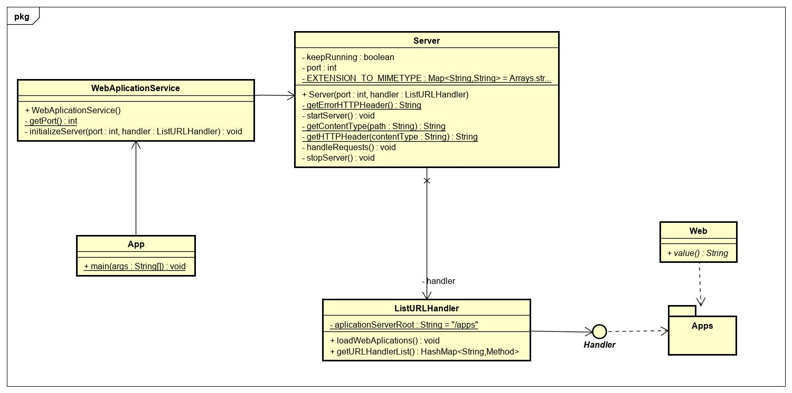
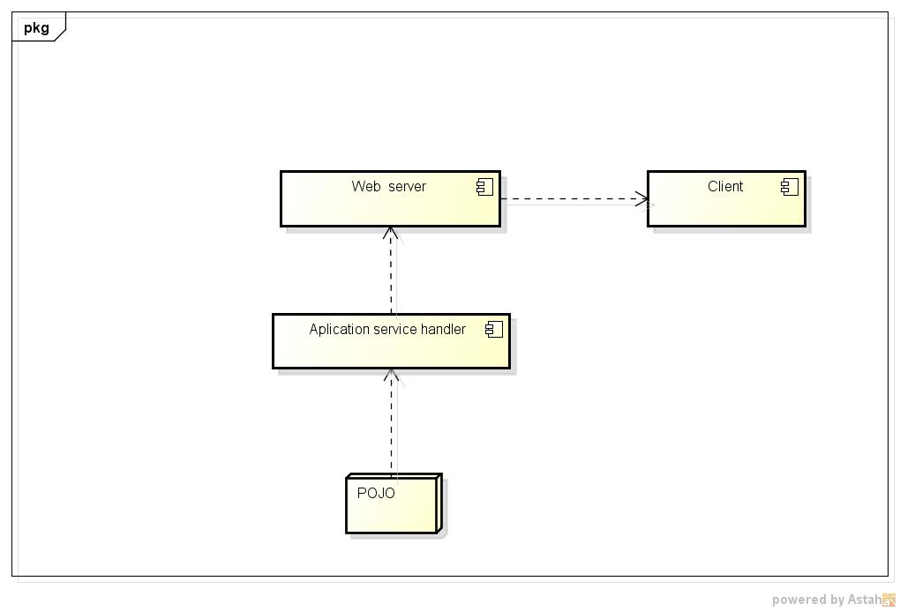

# Web Application  Server

### Prerequisites

 You need to have installed Java at least 1.8 and Apache Maven.

 Installing Apache Maven:
```
sudo apt update
sudo apt install maven
```
 Installing Java JDK Maven:
```
sudo apt update
sudo apt install openjdk-8-jdk
```

### Introduction
Título, autor, Introducción, Arquitectura de Software, Arquitectura de Despliegue, Descripción aplicación Web desarrollada en la plataforma, Conclusiones, Bibliografí

This is a web application server in which one a user is available to deploy its own application based on POJOS

Here is de design of the web application server:



## Architecture Deployment Diagram



The web application service handler receive a POJO it process it and put it available in the server in the defined URL.

## Web application description


These instructions will get you a copy of the project up and running on your local machine for development and testing purposes. See deployment for notes on how to deploy the project on a live system.


### Installing
 Download the repository.
```
git clone https://github.com/nicoga97/Aplication-Server.git
```
 

 
### How to use

  In order to run the app you need to build, compile and execute project with the following commands:
  ```
   mvn package
   mvn compile
   mvn exec:java 
   ```
  In order to serve an application you must put the application clases on the folder src/main/java/edu.escuelaing/arep/applicationServer/apps ,
  once yo do that the you have to put the annotation @Web('path') where 'path' is the url in which the server is going to call that method for example:
  

```
public class Test1 {
    

    @Web("method1")
    public static String method1() {
        return "<!DOCTYPE html>"
                + "<html>"
                + "<head>"
                + "<meta charset=\"UTF-8\">"
                + "<title>Test 1</title>\n"
                + "</head>"
                + "<body>"
                + "Test 1 is working"
                + "</body>"
                + "</html>";
    }
```

When you type in the url https//:server.com/apps/method1 is going to return a web page saying "Test 1 is working".

## Built With


* [Maven](https://maven.apache.org/) - Dependency Management.
* [reflections](https://github.com/ronmamo/reflections) - Used handle reflection in the web server.


## Authors

* [**Nicolas Garcia Rey**](https://github.com/nicoga97) - *Initial work* 

See also the list of [contributors](https://github.com/nicoga97/Aplication-Server/graphs/contributors) who participated in this project.

## License

This project is licensed under the MIT License - see the [LICENSE.md](LICENSE.md) file for details

